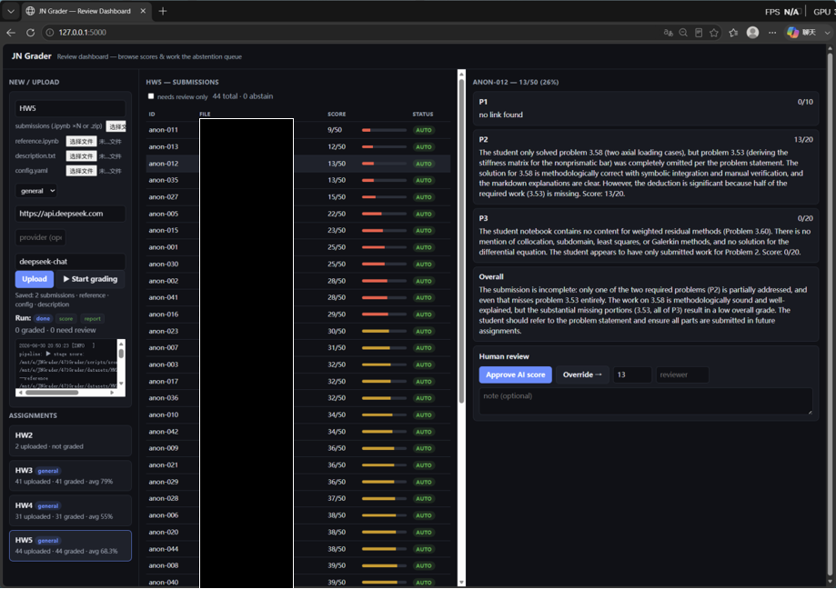

# JN Grader

**Grade Jupyter Notebook homework for any course — with reproducible execution,
reference-grounded LLM judgment, and a queryable results database.**

You provide, per assignment: a **problem statement**, a **correct reference
solution** (a notebook), and a folder of **student submissions**. JN Grader
executes the reference to obtain ground-truth answers, grades every submission
against it, and produces per-student Markdown reports plus rows in a Postgres
task bank you can query across assignments.

It is course-agnostic: nothing about a specific assignment is hard-coded — all
assignment knowledge lives in per-assignment files you drop in.



*The web workbench: upload an assignment, start a grading run, and review every
submission — scores, per-problem feedback, and the abstention queue — with
one-click approve / override (student names redacted).*

---

## Two grading engines

| When the answer is… | Engine | Entry script |
|---|---|---|
| **one number per question**, checkable with a tolerance | **Numeric autograder** | `score_notebooks.py` (+ `preprocess.py`, `run_tests.py`) |
| **matrices / derivations / multi-part**, or "submit a link" | **General grader** | `score_general.py` |

Both execute the reference solution for ground truth, share the same inputs
layout, and write the same reports and database records.

- **Numeric autograder** runs the notebook, compares the computed value to the
  reference within tolerance (hard pass/fail), then an LLM scores the *method*
  for partial credit.
- **General grader** runs the reference, captures its computed answers + written
  explanation, and an LLM scores each problem against that ground truth — judging
  both correctness and explanation quality, with per-problem points.

---

## Directory layout (one folder per assignment)

```
datasets/<ASSIGN>/
├── description.txt     # problem statement   → gen_config.py
├── reference.ipynb     # correct solution    → executed for ground-truth answers
├── config.yaml         # grading config      → auto-generated, then reviewed
└── submissions/        # student *.ipynb     → the grader's input

workspace/<ASSIGN>/     # outputs (git-ignored, regenerable)
└── scored/   reports/   processed/
```

> Keep `reference.ipynb` / `description.txt` **outside** `submissions/` — every
> `*.ipynb` in the input folder is treated as a student submission.

---

## Prerequisites

- **Docker** (recommended): `Dockerfile` + `docker-compose.yml` bundle Python, a
  Jupyter kernel, and Postgres + pgvector, and run student code as a non-root
  container user. (Or run the scripts directly with Python ≥ 3.10 and
  `pip install -r scripts/requirements.txt`.)
- **An LLM API key** in a `.env` file at the repo root:
  - OpenAI-compatible provider (default — DeepSeek, Qwen, SiliconFlow, …):
    `LLM_API_KEY=...`
  - and/or Anthropic (Claude): `ANTHROPIC_API_KEY=...` (used with `--provider anthropic`).

```bash
printf 'LLM_API_KEY=%s\n' '<your-key>' > .env     # .env is git-ignored
```

---

## Grade an assignment (general grader)

Drop `description.txt` + `reference.ipynb` into `datasets/<ASSIGN>/`, then:

```bash
cd 471Grader
ASSIGN=my-assignment        # the folder name and database key
LLM="--base-url https://api.deepseek.com --model deepseek-chat"   # your provider

# 1) LLM turns the description into a grading config (REVIEW the result)
docker compose run --rm grader python scripts/gen_config.py \
  datasets/$ASSIGN/description.txt --key $ASSIGN \
  --output datasets/$ASSIGN/config.yaml $LLM

# 2) Grade every submission against the reference
docker compose run --rm grader python scripts/score_general.py \
  datasets/$ASSIGN/submissions \
  --reference datasets/$ASSIGN/reference.ipynb \
  --config datasets/$ASSIGN/config.yaml \
  --description datasets/$ASSIGN/description.txt \
  --output workspace/$ASSIGN/scored $LLM

# 3) Markdown reports (per student + class summary)
docker compose run --rm grader python scripts/report.py \
  workspace/$ASSIGN/scored --output workspace/$ASSIGN/reports

# 4) Archive into the task bank (--max-score = the config's max_score)
docker compose up -d db
docker compose run --rm grader python scripts/db_ingest.py --key $ASSIGN \
  --title "$ASSIGN" --max-score 100 \
  --description datasets/$ASSIGN/description.txt \
  --reference datasets/$ASSIGN/reference.ipynb \
  --scored workspace/$ASSIGN/scored
```

Reports land in `workspace/$ASSIGN/reports/` (`summary.md` + one file per student).

## Grade an assignment (numeric autograder)

For "one numeric answer per question" assignments. The config uses a `questions:`
schema with per-question markers (how each question is labeled in the notebooks)
and a numerical tolerance — see [config.yaml](#configyaml).

```bash
# 1) Execute + autograde (expected answers derived by running the reference)
docker compose run --rm grader python scripts/preprocess.py \
  datasets/$ASSIGN/submissions --output workspace/$ASSIGN/processed \
  --reference datasets/$ASSIGN/reference.ipynb --config datasets/$ASSIGN/config.yaml

# 2) (optional) generate a process rubric from the description
docker compose run --rm grader python scripts/generate_rubric.py \
  datasets/$ASSIGN/description.txt --output workspace/$ASSIGN/rubric.yaml $LLM

# 3) LLM process scoring (numeric result score enforced from autograde)
docker compose run --rm grader python scripts/score_notebooks.py \
  workspace/$ASSIGN/processed --output workspace/$ASSIGN/scored \
  --reference datasets/$ASSIGN/reference.ipynb \
  --rubric workspace/$ASSIGN/rubric.yaml $LLM

# 4) reports + 5) archive — same as steps 3–4 above (add --ir workspace/$ASSIGN/processed)
```

Debug a single notebook's autograde:

```bash
docker compose run --rm grader python scripts/run_tests.py \
  datasets/$ASSIGN/submissions/<one>.ipynb \
  --reference datasets/$ASSIGN/reference.ipynb --config datasets/$ASSIGN/config.yaml
```

---

## config.yaml

`gen_config.py` writes the config from `description.txt`; always review it before
grading.

**General grader** — `problems:` schema:

```yaml
assignment: my-assignment
max_score: 100
criteria:                       # cross-cutting, applied to every problem
  - "Explanation & interpretation: explain the approach in markdown between code
     cells, comparable to the reference; deduct for code with little explanation."
problems:
  - {name: P1, points: 10, type: link, desc: "..."}   # link → full marks if a URL is present
  - {name: P2, points: 45, type: llm,  desc: "..."}   # llm  → graded against the reference
  - {name: P3, points: 45, type: llm,  desc: "..."}
```

**Numeric autograder** — `questions:` schema:

```yaml
questions:
  - {name: Q1, marker: '<student-side regex>', ref_marker: '<reference section>'}
  - {name: Q2, marker: '...',                   ref_marker: '...'}
rtol: 0.02
atol: 1.0e-8
answer_var: u                   # variable in the reference holding the answer
# expected:                     # optional hard-coded fallback if no runnable reference
physics_checks:                 # optional reference-free invariants (see below)
  - {name: stiffness_symmetric, type: symmetric, var: Kg, candidates: [K, Kglobal]}
  - {name: stiffness_psd,       type: psd,       var: Kg}
  - {name: bc_fixed_zero,       type: dirichlet, var: u, dofs: [0]}
```

**Physics invariants (`physics_checks:`)** — a second, reference-free
deterministic signal. Each invariant must hold for any correct FE solve
regardless of the numbers (`finite`, `bounded`, `symmetric`, `psd`, `dirichlet`,
`residual`, `net_sum`), so it needs no reference answer. A check is `na`
(ignored, never penalized) when its variable isn't materialized under the given
name(s); a **failure on a question whose answer passed** is a contradiction that
routes the submission to human review. Results land in
`autograde[Q].physics` and failing invariants are shown to the LLM.

**Plot/field comparison (`field_checks:`)** — extends the deterministic layer to
*graphical* output. The data behind a plot often never lands in a checkable
variable, so `field_checks.py` recovers the drawn curves from matplotlib's figure
state after execution and checks them: `plot_present`, `plot_bounded`,
`plot_monotonic` (e.g. displacement increases along a bar), `plot_endpoints`
(fixed end = 0), and `plot_matches` (a curve matches an expected array within
tolerance). Same `na`-safe, config-driven semantics; results land in
`autograde[Q].fields` and feed the same findings/gate path as physics checks.

```yaml
field_checks:
  - {name: plotted_something, type: plot_present,   min_curves: 1}
  - {name: disp_increasing,   type: plot_monotonic, direction: nondecreasing}
  - {name: disp_fixed_end,    type: plot_endpoints, first: 0.0}
```

## Reference oracle

Ground truth comes from **executing the reference solution**, not from hard-coded
values:

- **Numeric**: `run_tests.py --reference` runs the reference and reads the
  expected answer per question. Most robust convention: the reference defines
  `ANSWERS = {"Q1": ..., ...}`. Otherwise it snapshots `answer_var` at each
  question's section. Falls back to `config.yaml: expected:`.
- **General**: `score_general.py` executes the reference, captures its computed
  arrays and full markdown, and gives both to the LLM as the answer key and the
  expected level of explanation.

## LLM providers

Both graders use `scripts/llm_client.py`:

- `--provider openai` (default) — any OpenAI-compatible endpoint via `--base-url`
  + `--model`; key from `LLM_API_KEY`.
- `--provider anthropic` — native Anthropic SDK; key from `ANTHROPIC_API_KEY`.

`provider` is the **API protocol, not the vendor**. DeepSeek / Qwen / SiliconFlow
all expose an OpenAI-compatible API, so use `--provider openai` and point at them
with `--base-url` + `--model` — e.g. DeepSeek is
`--provider openai --base-url https://api.deepseek.com --model deepseek-chat`.

Only the process / per-problem score and feedback come from the model; the
numeric **result** score always comes from execution.

## Task bank (Postgres + pgvector)

Every assignment's results are archived into one database
(`assignments`, `submissions`, `results`, `problem_scores`, `diagnoses`;
`assignments.embedding vector(1024)` reserved for semantic similar-problem
grouping — embeddings pluggable, null by default).

```bash
docker compose up -d db
docker compose run --rm grader python scripts/db_query.py list                # all assignments
docker compose run --rm grader python scripts/db_query.py stats  --key $ASSIGN # per-problem averages
docker compose run --rm grader python scripts/db_query.py top    --key $ASSIGN --n 5 --lowest
docker compose run --rm grader python scripts/db_query.py errors --key $ASSIGN # numeric: failure rate
```

### Semantic similar-problem retrieval (pgvector)

`assignments.embedding vector(1024)` is filled by a pluggable embedder
(`scripts/embeddings.py`): `hash` (offline, deterministic, no API — default) or
`openai` (any OpenAI-compatible `/embeddings` endpoint). Use it to group/dedup
problems across assignments and locate prior work whose grading conventions apply.

```bash
# Populate embeddings (at ingest, or backfill all existing assignments)
docker compose run --rm grader python scripts/db_ingest.py ... --embed
docker compose run --rm grader python scripts/db_query.py embed --all          # hash (offline)
docker compose run --rm grader python scripts/db_query.py embed --all \
  --embed-provider openai --base-url https://api.openai.com/v1                  # real embeddings

# Nearest prior assignments by cosine similarity (auto-backfills missing vectors)
docker compose run --rm grader python scripts/db_query.py similar --key $ASSIGN --n 5
```

## Program memory (cross-assignment consistency)

`scripts/program_memory.py` sediments **course grading conventions** and
**high-frequency error patterns** from past scored assignments into a portable
per-course store (`workspace/memory/<course>.json`), then re-injects them into
later grading for consistency across assignments — closing the loop
`grade → sediment → next assignment grades with memory → re-sediment`.

It builds **deterministically** from signals the pipeline already emits (the
numeric engine's `error_class` + `first_divergence` locus; the general engine's
per-problem deductions) — no LLM required. An optional `--distill` pass only
compresses collected feedback into reusable convention bullets; it never changes
scores. The injected block is framed as **advisory priors** placed *after* the
deterministic findings — it must not override execution facts.

```bash
# After grading HW2 & HW4, sediment them into the course memory
python scripts/program_memory.py sediment --course ME471 \
  --scored workspace/HW2/scored workspace/HW4/scored \
  --store workspace/memory/ME471.json

python scripts/program_memory.py show --store workspace/memory/ME471.json

# Then grade the NEXT assignment with that memory (works with either engine)
python scripts/score_general.py datasets/HW5/submissions ... \
  --memory workspace/memory/ME471.json
python scripts/score_notebooks.py workspace/HW6/processed ... \
  --memory workspace/memory/ME471.json
```

Re-running `sediment` on an already-folded assignment is skipped (idempotent);
pass `--force` to re-fold after a re-grade.

**Semantic "similar-cause" recall** — when grading, the patterns injected are
ranked by **semantic relevance to the current assignment** (the general engine
uses its description, the numeric engine its reference) rather than by raw
frequency, so a topically-relevant pattern surfaces even if it is globally rarer.
This reuses `embeddings.py` (offline `hash` embedder by default — no API). Preview
it with a query:

```bash
python scripts/program_memory.py show --store workspace/memory/ME471.json \
  --query "boundary conditions and stiffness assembly"
```

## One-command pipeline + orchestration (Dify / n8n)

`scripts/pipeline.py` chains the stages for one assignment and emits a
machine-readable run manifest plus an exit code a workflow can branch on
(`0` = all auto, `10` = some abstained → human approval, `1` = a stage failed).

```bash
python scripts/pipeline.py --assign HW2 --engine numeric  $LLM   # preprocess→score→report
python scripts/pipeline.py --assign HW3 --engine general --ingest $LLM
python scripts/pipeline.py --assign HW2 --engine numeric --from report --to report  # one stage
```

The manifest lands at `workspace/<ASSIGN>/run_manifest.json` with per-stage
status and an `auto`/`abstain` review summary. `orchestration/` ships an
importable **n8n** workflow (with a `Wait`-based human-approval node fed by the
abstain queue) and documents the equivalent **Dify** HTTP wiring. See
[`orchestration/README.md`](orchestration/README.md).

### Grading workbench (web UI)

`webapp/` is a small Flask app that drives the whole loop from the browser:
**upload** an assignment's files (submissions `.ipynb`/`.zip` + optional
reference/description/config), **start grading** (runs `pipeline.py` in the
background with live status), then **review** — browse scores + feedback +
deterministic diagnostics and **work the abstention queue**, approving or
overriding flagged submissions. Each decision is persisted to
`workspace/<ASSIGN>/decisions/` (the visual form of the human-approval node). It
reads/writes the workspace live — no database required; API keys stay on the
server, never in the browser.

```bash
pip install -r webapp/requirements.txt
set -a; source .env; set +a     # give the server LLM_API_KEY for grading
python webapp/app.py            # http://127.0.0.1:5000
```

Then open **http://localhost:5000** in your browser (on WSL, `localhost` is
forwarded to Windows automatically; if it doesn't resolve, run with
`JN_HOST=0.0.0.0 python webapp/app.py` and use the machine's IP). Leave the
terminal running — it's the server; `Ctrl+C` stops it.

Using it:

1. **New / Upload** (left) — type an assignment key (e.g. `HW6`), choose the
   student submissions (`.ipynb` ×N or a `.zip`) and, optionally,
   `reference.ipynb` / `description.txt` / `config.yaml`; click **Upload**.
2. Pick the **engine** (`general` or `numeric`) and the LLM settings —
   `provider` is the *API protocol*: for DeepSeek use **`openai`** with
   **base-url** `https://api.deepseek.com` and **model** `deepseek-chat` (the key
   comes from the server's `.env`, not the form). Click **▶ Start grading** and
   watch the live run status.
3. Click a graded assignment, then a submission, to **review** — per-problem
   scores, feedback, and diagnostics. Use **needs review only** to jump to the
   abstention queue, then **Approve** the AI score or **Override** it with a note.

See [`webapp/README.md`](webapp/README.md) for the full API and details.

## Identity (anonymization)

Submissions are graded under anonymous ids (`anon-001`, …). `scripts/identity.py`
extracts the real **name / student number** from filenames and notebook headers
(best effort); they show up in reports and the database. When nothing is
detectable, the original filename is kept so you can map back manually.

## Adding a new assignment

1. Create `datasets/<ASSIGN>/`; put student notebooks in `submissions/`.
2. Add `description.txt` and a correct, runnable `reference.ipynb`.
3. `gen_config.py` → `config.yaml`; review points / `type` / markers.
4. Run the matching engine above. No code changes needed.

## Limitations

- **Truth depends on the reference** — it must run cleanly and follow the answer
  convention; a wrong reference yields wrong grades.
- **LLM judgment is advisory** — review the `top --lowest` queue for disputes.
- **Execution isn't fully sandboxed** — run via Docker; treat student code as
  untrusted.
- **Identity extraction is heuristic** — review before publishing grades.

## Repository layout

```
471Grader/
├── Dockerfile / docker-compose.yml# containerized run + pgvector `db` service
├── scripts/
│   ├── gen_config.py              # description.txt → config.yaml (LLM)
│   ├── preprocess.py / run_tests.py / generate_rubric.py / score_notebooks.py   # numeric engine
│   ├── physics_checks.py         # reference-free physics invariants (equilibrium/symmetry/PSD/BC/residual)
│   ├── field_checks.py           # plot/field comparison — recovers curves from matplotlib state
│   ├── pipeline.py               # end-to-end orchestrator: stages → run manifest + exit code
│   ├── score_general.py           # reference-grounded per-problem LLM grader
│   ├── report.py                  # scored JSON → Markdown reports
│   ├── program_memory.py         # sediment + reuse course conventions / error patterns
│   ├── embeddings.py             # pluggable text embedder (hash offline / openai) for pgvector
│   ├── eval_harness.py           # human-graded ground truth → agreement / localization metrics
│   ├── identity.py                # name / student-id extraction
│   ├── llm_client.py              # provider abstraction (openai / anthropic)
│   ├── db_common.py / db_ingest.py / db_query.py / db/schema.sql                # task bank
│   └── requirements.txt
├── orchestration/                # n8n workflow + Dify wiring (human-approval node)
├── webapp/                       # Flask workbench: upload → grade → review (human approval)
├── tests/                        # pytest suite
├── datasets/<ASSIGN>/             # per-assignment inputs
└── workspace/<ASSIGN>/            # generated outputs (git-ignored)
```

## License

MIT
